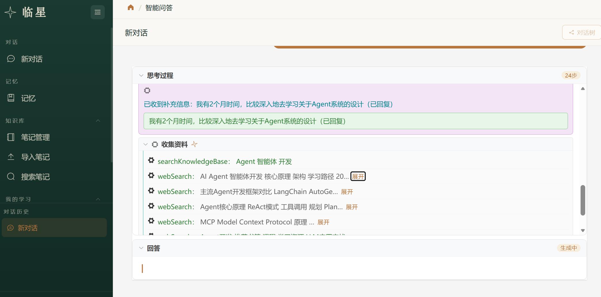
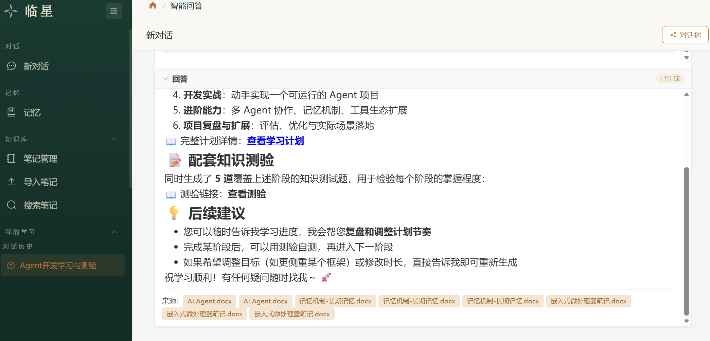
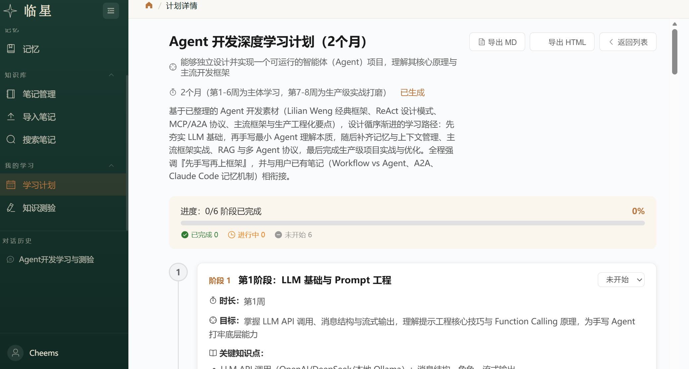
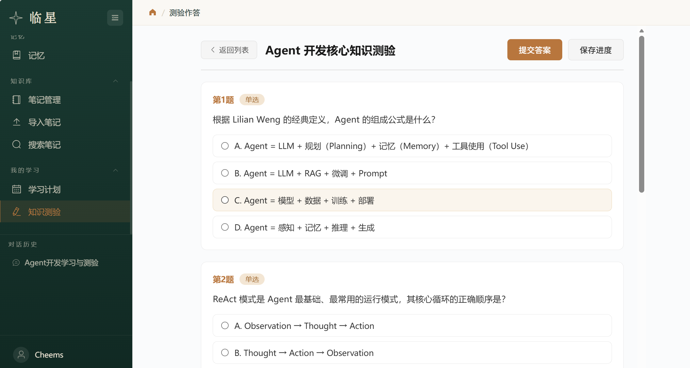
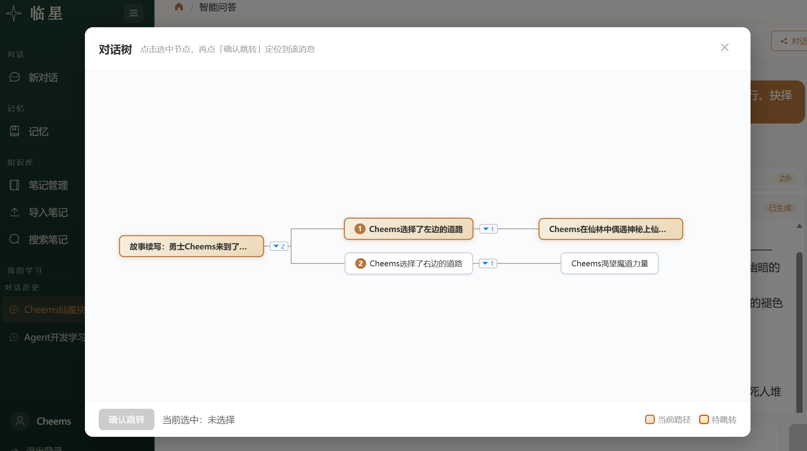

# Linxing

Agent 驱动的个人学习平台。基于自研 ReAct Agent 主循环与多 Agent 工作流，在个人笔记知识库（Node-Based RAG）之上提供智能问答、学习计划生成、知识测验出题与联网搜索能力。

## 为什么创建这个项目

个人学习材料（PDF / DOCX / Markdown / 笔记 / 代码片段）分散、难检索、难复习。Linxing 把这些材料统一入库为可检索的知识库，再用 Agent 把"检索"封装成一个可被 LLM 调用的工具，从而让对话、出题、生成学习计划等学习场景都建立在**用户自己的笔记**之上，而非通用语料。

## 适用场景

- 把课程笔记 / 技术文档 / 代码整理成个人知识库，并通过对话检索和使用
- 基于知识库自动生成学习计划与知识测验
- 在学习中联网补充外部资料并与笔记内容对照

## 核心特性

- **自写 ReAct Agent 主循环**：有上限推理-工具调用-观察循环，SSE 流式推送每一步事件，支持层次 step（parent/agentId）与心跳动画
- **多 Agent 工作流**：基于 `langchain4j-agentic` 的两阶段顺序编排（知识收集 → 内容生成），支持 HumanInTheLoop 打断补充
- **Node-Based RAG**：Python 服务统一解析所有文件类型为原子化 Node，Java 侧完成语义增强、父子 Chunk 装箱与向量化。Display / Index 文本双轨——展示文本保留原文形态（图片/代码/表格为占位符），索引文本含 VLM/LLM 语义增强结果
- **混合检索**：向量召回 + BM25 全文召回 + RRF 融合 + ONNX cross-encoder 重排序 + sigmoid 归一化阈值过滤 + 父块去重展开（small-to-big）
- **四层上下文管理**：短期记忆（纯累加器）+ Projection 三段式（Rewrite 纯规则 / Snip LLM ReAct / Summary 同步落盘）+ Redis Runtime Mirror（双 Hash 降级契约）+ 长期记忆（文件 Workspace）
- **长期记忆**：用户可编辑的半结构化 Markdown Workspace（Agent/User/Directory/Learning/Current + History 归档），Memory Worker 异步 ReAct 维护，常驻段注入对话上下文
- **渐进披露**：工具/技能数量超过阈值时，LLM 仅看到元工具，按需动态注入工具规格
- **技能系统**：基于 `SKILL.md`（YAML frontmatter）声明式技能，按需加载
- **多 LLM 供应商管理**：注册中心管理 MiniMax / DeepSeek / GLM / Kimi 等多个大模型配置

## 技术栈

| 技术 | 用途 |
|---|---|
| Spring Boot 4.0.5 / JDK 17 | 后端框架 |
| langchain4j 1.13.0 | RAG 框架 |
| langchain4j-agentic | 多 Agent 工作流编排 |
| langchain4j-embeddings-bge-small-zh-v15 | 本地嵌入模型（已停用，改调硅基流动 API bge-m3，1024 维） |
| langchain4j-pgvector 0.1.6 | 向量存储 |
| langchain4j-onnx-scoring + onnxruntime 1.20.0 | 已停用的本地 Cross-encoder 重排序（改调硅基流动 API rerank） |
| langchain4j-web-search-engine-tavily | 联网搜索 |
| MyBatis 4.0.0 + Druid 1.2.28 | ORM 与连接池（专用 Spring Boot 4 starter） |
| PostgreSQL + pgvector | 主库与向量库 |
| Redis (Lettuce) | Runtime Mirror / 幂等缓存 / 文档预览 |
| Caffeine | 技能指令 / 激活集 / RuleSetStore LRU 缓存 |
| jtokkit 1.1.0 | OpenAI 兼容 BPE tokenizer |
| JWT (jjwt 0.12.6) | 认证 |
| Vue 3.2.13 + Element Plus 2.13.7 | 前端 |
| FastAPI 0.115.6 + Uvicorn 0.34.0 | Python 文档解析服务 |
| PyMuPDF / pdfplumber / python-docx / mistune / beautifulsoup4 | 文档结构解析 |

## 项目结构

```
Linxing/
├── Linxing_Agent/              # Spring Boot 后端（org.linxing.linxing_agent）
│   └── src/main/java/org/linxing/linxing_agent/
│       ├── common/             # 共享基础设施：LlmManager / RedisConfig / LlmProperties / JWT 拦截器 / GlobalExceptionHandler
│       ├── user/               # 用户认证（注册 / 登录 / 登出）
│       ├── rag/                # 知识检索域
│       │   ├── node/           # Node 数据载体（Code/Image/Table/Text/Heading/Formula/Document）
│       │   ├── parse/          # Python 服务对接、Node 反序列化（DocumentAnalysisFacade）
│       │   ├── enhancement/    # VLM/LLM 语义增强（IMAGE/CODE/TABLE）
│       │   ├── chunk/          # Node 装箱为 Chunk（父子关系，NodeBasedChunkBuilder）
│       │   ├── pipeline/        # 入库责任链协调器（ChunkIngestCoordinator）
│       │   ├── service/        # 混合检索、向量持久化、全文索引、RuntimeMirror
│       │   ├── strategy/       # @Deprecated 旧分片策略（已迁移至 Python）
│       │   ├── render/         # @Deprecated 旧渲染器（双轨已内联到 NodeBasedChunkBuilder）
│       │   └── controller/     # 文档上传 / 检索 / 分块上下文接口
│       └── agent/              # Agent 编排核心
│           ├── core/           # ReAct 主循环、AgentContext、StepRecorder、SSE 事件、超时 watchdog、HumanInTheLoop
│           ├── adapter/        # SSE 流式响应适配器（含 requestId 幂等）
│           ├── tool/           # 工具注册中心与各工具实现（含长期记忆工具）
│           ├── skill/          # 技能注册中心（SKILL.md 扫描，三阶段加载）
│           ├── catalog/        # 渐进披露目录
│           ├── memory/         # 短期记忆 + Projection + Redis Mirror + 长期记忆
│           │   ├── window/     # ContextBuilder / Recovery / Projection 三段式 / RuleSetStore
│           │   ├── longterm/   # MemoryWorkspace / MemoryWorker / LongMemoryInjector
│           │   └── deprecated/ # 旧 WindowMemory / SummaryMemory
│           ├── subagent/       # study_plan 两阶段多 Agent 工作流
│           └── controller/     # 对话 / 测验 / 学习计划 / 长期记忆接口
├── document_analysis_service/  # Python FastAPI 文档解析服务
│   ├── app.py                  # FastAPI 入口，/parse 与 /health
│   ├── config.py               # 环境变量配置
│   └── parsers/                # 各文件类型解析器，统一产出 Node JSON
├── webconsole/                 # Vue 3 前端
│   └── src/
│       ├── api/agent/          # 后端接口封装（chat/search/ingest/exam/studyPlan/workflow/memory）
│       ├── stores/agent/       # 自封装状态管理（chatSessionStore/chatTreeStore）
│       ├── composables/        # Markdown 渲染等组合式函数
│       ├── views/agent/        # 页面级组件（含 MemoryView）
│       ├── components/agent/   # 业务组件（含 MemoryPanel）
│       ├── layouts/            # AppLayout 主布局
│       └── router/            # 路由表与守卫
├── files_store/                # 文档与图片存储（gitignore，含 memory/{userId}/）
├── reference/                  # 开发参考/计划（gitignore）
└── AGENTS.md                   # 架构与开发约束详述
```

## 架构概览

```
┌─────────────┐     SSE/HTTP      ┌──────────────────────────────┐
│  webconsole │ ─────────────────▶│      Linxing_Agent           │
│  (Vue 3)    │◀─────────────────│  ReAct Agent + 多 Agent 工作流 │
└─────────────┘   /api 前缀剥离   └──────────┬───────────────────┘
                                            │
                       ┌────────────────────┼────────────────────┐
                       ▼                    ▼                    ▼
              ┌────────────────┐   ┌─────────────────┐   ┌──────────────┐
              │ document_      │   │ PostgreSQL /    │   │   Redis      │
              │ analysis_      │   │ pgvector        │   │ Runtime Mirror│
              │ service        │   │ chunks/embeddings│  │ 幂等/预览缓存 │
              └────────────────┘   └─────────────────┘   └──────────────┘
```

**文档入库数据流**：

1. 用户在前端上传文档 → 后端 `/rag/ingest/file`
2. Java 侧 `DocumentAnalysisFacade` 调用 Python `/parse`，得到 Node JSON 列表
3. `SemanticEnhancementService` 对图片（VLM）、代码（LLM）、表格（LLM）做语义增强
4. `NodeBasedChunkBuilder` 装箱 Chunk（父子关系构建），同时生成 `chunkText`（展示）与 `indexText`（索引）
5. `ChunkIngestCoordinator` 责任链完成向量化与全文索引，持久化到 PG

**对话数据流**：用户提问 → `HistoryRecoveryService` 从 Redis Mirror 回溯历史 → `DefaultContextBuilder` 三段装配 + Projection 判定 → `AgentExecutor` ReAct 循环 → 必要时调 `search_knowledge_base`/`web_search` → `LongMemoryInjector` 注入长期记忆常驻段 → LLM 生成回答 → SSE 推送层次 step 事件 → 回答完成后 `MemoryWorkerReActLoop` 异步维护长期记忆。

## 快速开始

### 环境要求

- JDK 17+
- Maven
- Node.js 16+
- Python 3.10+
- PostgreSQL 14+ 且**已安装 pgvector 扩展**
- Redis 6+

### 1. 准备数据库

创建数据库 `vectordb` 并启用 pgvector 扩展，schema 见 [Linxing_Agent/src/main/resources/schema.sql](Linxing_Agent/src/main/resources/schema.sql)。

### 2. 配置环境变量

后端 `application.yaml` 通过环境变量注入敏感信息。在 [Linxing_Agent/src/main/resources/](Linxing_Agent/src/main/resources/) 下创建 `application-dev.yaml`，填入：

- `PG_HOST` / `PG_PORT` / `PG_DATABASE` / `PG_USER` / `PG_PASSWORD`
- `REDIS_HOST` / `REDIS_PORT` / `REDIS_PASSWORD`
- `RAG_STORE_PATH`（文档与图片存储根目录，替代 OSS 服务）
- `LLM_DEFAULT_PROVIDER` 对应大模型提供商的 `api-key` / `base-url` / `model` 等
- `TAVILY_API_KEY`
- `JWT_SECRET_KEY` / `JWT_TTL` / `JWT_TOKEN_NAME`

### 3. 启动 Python 文档解析服务

Python 服务需**先于后端启动**（后端文档入库依赖它）。

```bash
cd document_analysis_service
pip install -r requirements.txt
uvicorn app:app --host 0.0.0.0 --port 18000   # 或 python app.py
```

### 4. 启动后端

```bash
cd Linxing_Agent
./mvnw spring-boot:run   # 或 mvn spring-boot:run
```

### 5. 启动前端

```bash
cd webconsole
yarn install   # 或 npm install
yarn serve     # 或 npm run serve
```

### 访问地址

| 服务 | 地址 |
|---|---|
| 前端 | http://localhost:3000 |
| 后端 API | http://localhost:8080 |
| Python 解析服务 | http://localhost:18000 |
| Python 健康检查 | http://localhost:18000/health |

## 配置说明

以下为开发者常需调整的配置项，完整配置见 [Linxing_Agent/src/main/resources/application.yaml](Linxing_Agent/src/main/resources/application.yaml)。

### LLM 模型

`llm.*`（顶级配置）通过 `rag.llm.default-provider` 切换供应商（`minimax` / `deepseek` / `glm` / `kimi` / `other1`），均走 OpenAI 兼容 API。DeepSeek 支持 `return-thinking` 与 `send-thinking`。`other1` 用于 VLM 多模态图片理解。

### Agent 行为

| 配置 | 默认值 | 说明 |
|---|---|---|
| `agent.disclosure.threshold` | 5 | 工具+技能超过此值启用渐进披露 |
| `agent.tool.timeout-seconds` | 180 | 普通工具超时 |
| `agent.tool.workflow-timeout-seconds` | 600 | 工作流工具超时 |
| `agent.token.encoding` | cl100k_base | jtokkit 编码名 |
| `agent.token.max-context` | 200000 | 模型上下文上限（Projection 判定基准，TODO 待调研修正） |
| `agent.memory.longterm.workspace.root-dir` | env | 长期记忆工作区根目录（按 userId 隔离） |
| `agent.memory.longterm.worker.max-steps` | 6 | Memory Worker ReAct 小循环最大 LLM 轮次 |

### Projection 三段式阈值

| 配置 | 默认值 | 说明 |
|---|---|---|
| `agent.projection.thresholds.full-to-rewrite` | 0.60 | 触发 Rewrite（纯规则）的 token 占比阈值 |
| `agent.projection.thresholds.rewrite-to-snip` | 0.80 | 触发 Snip（LLM ReAct）的阈值 |
| `agent.projection.thresholds.snip-to-summary` | 0.90 | 触发 Summary（同步落盘）的阈值 |
| `agent.snip.enabled` | true | Snip 异步产出总开关 |
| `agent.snip.max-steps` | 6 | Snip ReAct 小循环最大步数 |
| `agent.snip.executor.*` | 2/4/32/snip- | Snip 线程池配置 |

### 检索与缓存

| 配置 | 默认值 | 说明 |
|---|---|---|
| `rag.search.score-threshold` | 0.35 | Rerank API relevance_score（[0,1]）相关性阈值，0 关闭 |
| `rag.api.embedding.*` | 关闭 | 硅基流动向量化 API（enabled/base-url/api-key/model/timeout-seconds/max-retries，默认 bge-m3） |
| `rag.api.reranker.*` | 关闭 | 硅基流动 Rerank API（enabled/base-url/api-key/model/batch-size/timeout-seconds/max-retries，默认 bge-reranker-v2-m3） |
| `rag.vector-store.dimension` | 1024 | embedding 输出维度（必须与模型一致；旧库 512 维需执行 `migrations/20260817_embedding_dim_1024.sql` 迁移） |
| `rag.cache.mirror-ttl` | 43200 | Runtime Mirror TTL（秒，12h） |
| `rag.cache.chat-response-ttl` | 2100 | 幂等缓存 TTL（秒，35min，略大于 SSE 超时） |
| `rag.cache.doc-preview-ttl` | 3600 | 文档预览缓存 TTL（秒） |
| `rag.cache.session-messages-ttl` | 1800 | @deprecated 旧会话消息缓存 TTL |
| `rag.cache.agent-steps-ttl` | 3600 | @deprecated 旧 Agent 步骤缓存 TTL |
| `rag.semantic-enhancement.context.previous-nodes` | 2 | 语义增强前文 Node 数 |
| `rag.semantic-enhancement.context.next-nodes` | 2 | 语义增强后文 Node 数 |

### Python 服务对接

| 配置 | 默认值 | 说明 |
|---|---|---|
| `rag.python-service.url` | http://localhost:18000 | Python 解析服务地址 |
| `rag.python-service.timeout-seconds` | 120 | 调用超时 |
| `rag.python-service.image-store-dir` | ${RAG_STORE_PATH}/chunk_images | 图片落盘目录 |

Python 服务侧的环境变量见 [document_analysis_service/config.py](document_analysis_service/config.py)（`SERVICE_HOST` / `SERVICE_PORT` / `IMAGE_STORE_DIR` / `IMAGE_URL_PREFIX`）。

## 部分功能使用效果示例

> 运行推理过程中的Agent：



> 生成效果：



> 对话树功能演示：


## 主要 API

| 方法 | 路径 | 说明 |
|---|---|---|
| POST | `/user/register` `/user/login` `/user/logout` | 用户认证 |
| POST | `/agent/chat` | Agent 对话（SSE 流式） |
| POST | `/agent/workflow/clarify` | 工作流澄清回复 |
| GET/POST/DELETE | `/agent/sessions[...]` | 会话管理 |
| PUT | `/agent/sessions/{id}/title` | 更新会话标题 |
| POST | `/agent/sessions/{id}/auto-title` | AI 自动命名 |
| GET | `/agent/sessions/{id}/messages` | 消息列表 |
| GET | `/agent/messages/{id}/steps` | 查看推理步骤（懒加载） |
| DELETE | `/agent/messages/{id}/subtree` | 删除消息子树 |
| GET/POST | `/agent/memory/files` `/agent/memory/file` | 长期记忆文件读写 |
| GET | `/exam` `/exam/{id}` `/exam/by-plan/{planId}` | 测验列表与详情 |
| POST | `/exam/{id}/submit` `/exam/{id}/draft` | 提交答题 / 保存草稿 |
| GET | `/study-plan` `/study-plan/{id}` | 学习计划 |
| PUT | `/study-plan/{id}/phase/{phaseId}/progress` | 更新阶段进度 |
| GET | `/study-plan/{id}/export?format=md` | 导出计划 |
| POST | `/rag/ingest/file` | 上传文档 |
| GET/DELETE | `/rag/documents[...]` | 文档管理 |
| POST | `/rag/search` | 知识库检索 |
| GET | `/rag/chunks/{id}/context` | 分块上下文 |

> 后端路径无 `/api` 前缀；前端调用统一加 `/api`，由 `vue.config.js` 代理剥离。所有非登录注册接口需携带 Bearer Token。

### 前端构建

```bash
cd webconsole
yarn build                  # 生产构建
yarn lint                   # 代码检查
```

## 进一步阅读

- [AGENTS.md](AGENTS.md) — 架构、关键约束、依赖详述
- [document_analysis_service/README.md](document_analysis_service/README.md) — Python 解析服务文档
- [webconsole/README.md](webconsole/README.md) — 前端文档
- [Linxing_Agent/src/main/resources/schema.sql](Linxing_Agent/src/main/resources/schema.sql) — 数据库 schema
