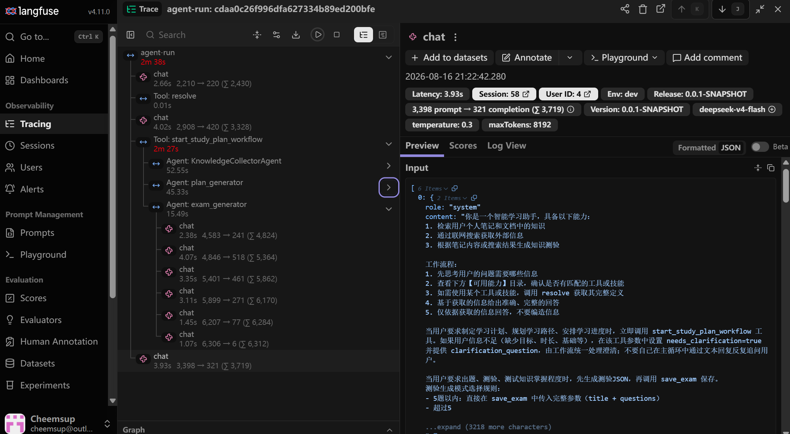
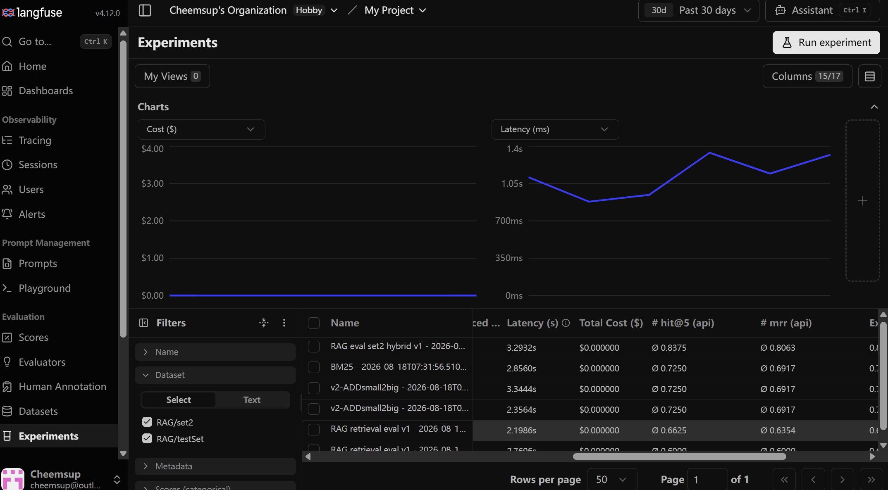

# Linxing

Agent 驱动的个人学习平台。基于自写 ReAct Agent 主循环，包含完整的tool、skill、记忆、RAG、观测体系，提供问答、学习计划生成、知识测验出题与联网搜索能力。

## 核心特性

- **自写 ReAct Agent 主循环**：有限推理-工具调用-观察循环，SSE 流式推送每一步事件，支持层次 step显示效果
- **多 Agent 工作流**：基于 `langchain4j-agentic` 构建多Agent协作的学习计划生成工作流，支持 HumanInTheLoop 打断补充
- **Node-Based RAG**：Python 服务统一解析所有文件类型为原子化 Node，Java 侧完成语义增强、父子 Chunk 装箱与向量化入库。Display / Index 文本双轨——入库语义信息的同时保留片段的原文形态（图片/代码/表格为占位符）
- **混合检索**：向量召回 + BM25 全文召回 + RRF 融合 + reranker 重排序 + sigmoid 归一化阈值过滤 + 父块去重展开（small-to-big），构建完善的RAG体系功能
- **上下文和记忆管理**：短期记忆采用三段式（Rewrite 规则 / Snip LLM ReAct / Summary ）精简和压缩模型窗口上下文，使用redis双hash提速和维护窗口内容；提供用户/Agent双轨的长期记忆体系，支持个性化Agent、时效性计划、历史内容沉淀
- **渐进披露**：工具/技能数量超过数量阈值后采取分阶段注入的方式获取原始tool schema和skill原文
- **多 LLM 供应商管理**：注册中心管理 MiniMax / DeepSeek / GLM / Kimi 等多个大模型配置
- **Langfuse 可观测性**：自定义 ChatModelListener 构建OTel格式数据并发往langfuse观测端点，支持不同粒度的Agent观测与审计

## 技术栈

| 技术 | 用途 |
|---|---|
| Spring Boot 4.0.5 / JDK 17 | 后端框架 |
| langchain4j 1.13.0 | Agent开发框架 |
| langchain4j-pgvector 0.1.6 | 向量存储 |
| langchain4j-web-search-engine-tavily | 联网搜索 |
| MyBatis 4.0.0 + Druid 1.2.28 | ORM 与连接池 |
| PostgreSQL + pgvector | 主库与向量库 |
| Redis (Lettuce) | Runtime Mirror / 幂等/消息/文档等缓存 |
| Caffeine | 技能指令 / 激活集 / RuleSetStore LRU 缓存 |
| jtokkit 1.1.0 | tokenizer |
| OpenTelemetry SDK 1.55.0 | Langfuse 审计（OTLP 直连导出） |
| JWT (jjwt 0.12.6) | 认证 |
| Vue 3.2.13 + Element Plus 2.13.7 | 前端 |
| FastAPI 0.115.6 + Uvicorn 0.34.0 | Python 文档解析服务 |
| PyMuPDF / pdfplumber / python-docx / mistune / beautifulsoup4 | 文档结构解析 |

## 项目结构

```
Linxing/
├── Linxing_Agent/              # Spring Boot 后端（org.linxing.linxing_agent）
│   ├── src/main/java/org/linxing/linxing_agent/
│   │   ├── common/             # 共享基础设施：LlmManager / RedisConfig / LlmProperties / JWT 拦截器 / GlobalExceptionHandler
│   │   │   └── config/ constant/ exception/ interceptor/ result/ security/ userInfoMaintainer/
│   │   ├── user/               # 用户认证（注册 / 登录 / 登出）
│   │   ├── rag/                # 知识检索域（Node-Based RAG）
│   │   │   ├── node/           # Node 数据载体（Code/Image/Table/Text/Heading/Formula/Document）
│   │   │   ├── parse/          # Python 服务对接、Node 反序列化（DocumentAnalysisFacade）
│   │   │   ├── enhancement/    # VLM/LLM 语义增强（IMAGE/CODE/TABLE）
│   │   │   ├── chunk/          # Node 装箱为 Chunk（父子关系，NodeBasedChunkBuilder）
│   │   │   ├── pipeline/       # 入库责任链协调器（ChunkIngestCoordinator + handler/）
│   │   │   ├── service/        # 混合检索 / 入库 / 文档管理 / 分块上下文（Search/Ingest/Document/ChunkServiceImpl）
│   │   │   ├── mapper/         # MyBatis Mapper（Chunk / Embedding / Document）
│   │   │   ├── entity/ dto/ vo/# 数据载体与出入参（SearchRequest / SearchResultVO / NodeDTO）
│   │   │   ├── utils/          # Reranker / ReciprocalRankFusion / VectorUtils / KeywordExtractor
│   │   │   ├── config/         # RagProperties / LangChain4jConfig
│   │   │   ├── strategy/       # @Deprecated 旧分片策略（已迁移至 Python）
│   │   │   ├── render/         # @Deprecated 旧渲染器（双轨已内联到 NodeBasedChunkBuilder）
│   │   │   └── controller/     # 上传 / 检索 / 分块上下文 / 文档管理接口
│   │   ├── agent/              # Agent 编排核心
│   │   │   ├── core/           # ReAct 主循环、AgentContext、StepRecorder、SSE 事件、超时 watchdog、HumanInTheLoop、SubAgentStepListener
│   │   │   ├── adapter/        # SSE 流式响应适配器（含 requestId 幂等）
│   │   │   ├── tool/           # 工具注册中心与各工具实现（含长期记忆、JSON 容器工具）
│   │   │   ├── skill/          # 技能注册中心（SKILL.md 扫描，三阶段加载）
│   │   │   ├── catalog/        # 渐进披露目录
│   │   │   ├── memory/         # 短期记忆 + Projection + Redis Mirror + 长期记忆
│   │   │   │   ├── window/     # ContextBuilder / Recovery / Projection 三段式 / RuleSetStore / runtime
│   │   │   │   ├── longterm/   # MemoryWorkspace / MemoryWorker / LongMemoryInjector + tool/
│   │   │   │   └── deprecated/ # 旧 WindowMemory / SummaryMemory
│   │   │   ├── subagent/       # 子 Agent 工作流（study_plan 两阶段编排）
│   │   │   ├── service/        # 业务服务层：Chat / Session / Exam / StudyPlan / RuntimeMirror
│   │   │   ├── entity/ dto/ vo/ mapper/ handler/   # 会话/消息/步骤/测验/学习计划持久化与 JSONB 处理
│   │   │   └── controller/     # 对话 / 测验 / 学习计划接口（长期记忆在 memory/ 下）
│   │   ├── observability/      # Langfuse 观测：AgentObservability / OtelTraceConfig / ChatModelListener / ObservableContext / MessageSerializer
│   │   └── constant/           # 顶层公共常量（JwtClaims 等）
│   └── src/main/resources/
│       ├── application.yaml    # 主配置（环境变量占位）
│       ├── application-dev.yaml# ⚠️ 本地必需，被 gitignore（含密钥）
│       ├── schema.sql          # 数据库 DDL（含 pgvector）
│       ├── mapper/{rag,user,agent}/   # MyBatis XML
│       ├── skills/{exam,study-plan,_shared}/  # Agent 技能指令
│       └── memory-templates/   # 长期记忆初始化模板
├── document_analysis_service/  # Python FastAPI 文档解析服务
│   ├── app.py                  # FastAPI 入口，/parse 与 /health
│   ├── config.py               # 环境变量配置（含 MinerU 云端 PDF 解析）
│   ├── parsers/                # 各文件类型解析器（pdf/docx/markdown/html/code/router 等）
│   ├── requirements.txt        # Python 依赖
│   └── README.md               # 解析服务文档
├── webconsole/                 # Vue 3 前端
│   └── src/
│       ├── api/agent/          # 后端接口封装（chat/search/ingest/exam/studyPlan/workflow/memory/chunk/document）
│       ├── stores/agent/       # 自封装状态管理（chatSessionStore/chatTreeStore）
│       ├── composables/        # Markdown 渲染等组合式函数
│       ├── views/              # 页面级组件（agent/ 业务页 + auth/ 认证页）
│       ├── components/agent/   # 业务组件（ChatPanel/ChatTreePanel/MemoryPanel/DocumentPreview/StarLoader 等）
│       ├── layouts/            # AppLayout 主布局
│       └── router/             # 路由表与守卫
├── docs/                       # README 截图（images/）
├── langfuse_dataset/           # RAG 检索评测工具集：考题生成 + Hit@K/MRR 评测（gitignore）
├── files_store/                # 文档与图片存储（gitignore，含 memory/{userId}/）
├── reference/                  # 开发参考/计划（gitignore）
└── AGENTS.md                   # 架构与开发约束详述
```

## 架构概览

```
┌─────────────┐     SSE/HTTP      ┌──────────────────────────────┐
│  webconsole │ ─────────────────▶│      Linxing_Agent           │
│  (Vue 3)    │◀─────────────────│  ReAct Agent + 多 Agent 工作流 │
└─────────────┘                    └──────────┬───────────────────┘
                                            │
                       ┌────────────────────┼────────────────────┐
                       ▼                    ▼                    ▼
              ┌────────────────┐   ┌─────────────────┐   ┌──────────────┐
              │ document_      │   │ PostgreSQL /    │   │   Redis      │
              │ analysis_      │   │ pgvector        │   │ Runtime Mirror│
              │ service        │   │ chunks/embeddings│  │ 幂等/预览缓存 │
              └────────────────┘   └─────────────────┘   └──────────────┘
```

## 快速开始

### 环境要求

- JDK 17+
- Maven
- Node.js 16+
- Python 3.10+
- PostgreSQL 14+ 且**已安装 pgvector 扩展**
- Redis 6+

### 1. 准备数据库

创建数据库 `vectordb` 并启用 pgvector 扩展，schema 见 [Linxing_Agent/src/main/resources/schema.sql](Linxing_Agent/src/main/resources/schema.sql)。

### 2. 配置环境变量

后端 `application.yaml` 通过环境变量注入敏感信息。在 [Linxing_Agent/src/main/resources/](Linxing_Agent/src/main/resources/) 下创建 `application-dev.yaml`，填入：

- `PG_HOST` / `PG_PORT` / `PG_DATABASE` / `PG_USER` / `PG_PASSWORD`
- `REDIS_HOST` / `REDIS_PORT` / `REDIS_PASSWORD`
- `RAG_STORE_PATH`（文档与图片存储根目录，替代 OSS 服务）
- `LLM_DEFAULT_PROVIDER` 对应大模型提供商的 `api-key` / `base-url` / `model` 等
- `TAVILY_API_KEY`
- `JWT_SECRET_KEY` / `JWT_TTL` / `JWT_TOKEN_NAME`

### 3. 启动 Python 文档解析服务

Python 服务需**先于后端启动**（后端文档入库依赖它）。

```bash
cd document_analysis_service
pip install -r requirements.txt
uvicorn app:app --host 0.0.0.0 --port 18000   # 或 python app.py
```

### 4. 启动后端

```bash
cd Linxing_Agent
./mvnw spring-boot:run   # 或 mvn spring-boot:run
```

### 5. 启动前端

```bash
cd webconsole
yarn install   # 或 npm install
yarn serve     # 或 npm run serve
```

### 访问地址

| 服务 | 地址 |
|---|---|
| 前端 | http://localhost:3000 |
| 后端 API | http://localhost:8080 |
| Python 解析服务 | http://localhost:18000 |

## 配置说明

以下为开发者常需调整的配置项，完整配置见 [Linxing_Agent/src/main/resources/application.yaml](Linxing_Agent/src/main/resources/application.yaml)。敏感信息一律经环境变量注入，本地 `application-dev.yaml`（gitignore）落真实值。

### 数据源与 Redis

| 配置 | 默认值 | 说明 |
|---|---|---|
| `spring.datasource.url` | `jdbc:postgresql://127.0.0.1:5432/vectordb` | PG 主库连接（`PG_HOST`/`PG_PORT`/`PG_DATABASE`/`PG_USER`/`PG_PASSWORD`） |
| `spring.data.redis.host/port/database` | localhost / 6379 / 0 | Redis 连接（`REDIS_HOST`/`REDIS_PORT`/`REDIS_PASSWORD`/`REDIS_DATABASE`） |
| `spring.servlet.multipart.max-file-size` | 50MB | 上传文档大小上限 |

### LLM 模型

`llm.*`通过 **`llm.default-provider`** 切换供应商（`minimax` / `deepseek` / `glm` / `kimi` / `other1`），均走 OpenAI 兼容 API。公共参数：`llm.temperature=0.3`、`llm.timeout-seconds=180`、`llm.max-tokens=8192`；`llm.retry.*` 控制非流式模型内置重试（`max-retries=2`，退避 `initial-backoff-ms=500`/`backoff-multiplier=2`/`jitter-ratio=0.2`）。

DeepSeek 支持 `return-thinking: true`（返回思维链）与 `send-thinking`。各用途模型映射见 `common/constant/LlmType`。

### Agent 行为

| 配置 | 默认值 | 说明 |
|---|---|---|
| `agent.disclosure.threshold` | 5 | 工具+技能超过此值启用渐进披露 |
| `agent.tool.timeout-seconds` | 180 | 普通工具超时 |
| `agent.tool.workflow-timeout-seconds` | 600 | 工作流工具超时 |
| `agent.token.encoding` | cl100k_base | jtokkit 编码名 |
| `agent.token.max-context` | 200000 | 模型上下文上限（Projection 判定基准） |
| `agent.memory.longterm.workspace.root-dir` | `./files_store/memory` | 长期记忆工作区根目录（按 userId 子目录隔离） |
| `agent.memory.longterm.worker.max-steps` | 6 | Memory Worker ReAct 小循环最大 LLM 轮次 |
| `agent.skills.path` | （空） | 技能目录外部覆盖（默认扫描 resources/skills） |

### Projection 三段式阈值

| 配置 | 默认值 | 说明 |
|---|---|---|
| `agent.projection.thresholds.full-to-rewrite` | 0.60 | 触发 Rewrite（纯规则）的 token 占比阈值 |
| `agent.projection.thresholds.rewrite-to-snip` | 0.80 | 触发 Snip（LLM ReAct）的阈值 |
| `agent.projection.thresholds.snip-to-summary` | 0.90 | 触发 Summary（同步落盘）的阈值 |
| `agent.projection.thresholds.summary-max-ratio` | 0.3 | Summary 压缩目标占 max-context 比例（当前未使用） |
| `agent.snip.enabled` | true | Snip 异步产出总开关 |
| `agent.snip.skip-turn-llm-enabled` | true | SkipTurn LLM ReAct 开关（false=只跑 Rewrite 纯规则） |
| `agent.snip.max-steps` | 6 | Snip ReAct 小循环最大步数 |
| `agent.snip.executor.*` | 2/4/32/snip- | Snip 线程池配置 |
| `agent.snip.rewrite.result-token-threshold` | 200 | 工具结果 token 超此值才产 RewriteToolRule |
| `agent.snip.rewrite.read-only-tools` | search_knowledge_base / web_search / resolve | Rewrite 白名单（只读工具） |

### 检索与缓存

| 配置 | 默认值 | 说明 |
|---|---|---|
| `rag.store-path` | ./files_store | 文档与图片存储根目录 |
| `rag.search.score-threshold` | 0.35 | Rerank API relevance_score（[0,1]）相关性阈值，0 关闭 |
| `rag.search.default-top-k` | 5 | 默认返回条数（代码默认，见 RagParameters） |
| `rag.search.recall-size` | 20 | 向量召回量 |
| `rag.search.hybrid-enabled` | true | 混合检索总开关 |
| `rag.search.vector-weight` / `bm25-weight` | 0.7 / 0.3 | RRF 融合权重 |
| `rag.search.bm25-recall-size` | 20 | BM25 召回量 |
| `rag.api.embedding.enabled` | false | 向量化 API 总开关（硅基流动 bge-m3，1024 维） |
| `rag.api.embedding.base-url/api-key/model` | - | OpenAI 兼容 /v1/embeddings 配置 |
| `rag.api.reranker.enabled` | false | Rerank API 总开关（硅基流动 bge-reranker-v2-m3） |
| `rag.api.reranker.base-url/api-key/model/batch-size` | - / 8 | /v1/rerank 配置与批大小 |
| `rag.vector-store.dimension` | 1024 | embedding 输出维度（注意必须与模型一致） |
| `rag.cache.mirror-ttl` | 43200 | Runtime Mirror TTL（秒，12h） |
| `rag.cache.chat-response-ttl` | 2100 | `chat:response:{requestId}` 幂等缓存 TTL（秒，略大于 SSE 超时） |
| `rag.cache.doc-preview-ttl` | 3600 | 文档预览缓存 TTL（秒） |
| `rag.cache.session-messages-ttl` | 1800 | @deprecated 旧会话消息缓存 TTL |
| `rag.cache.agent-steps-ttl` | 3600 | @deprecated 旧 Agent 步骤缓存 TTL |
| `rag.semantic-enhancement.context.previous-nodes` / `next-nodes` | 2 / 2 | 语义增强相邻 Node 数 |
| `rag.semantic-enhancement.context.max-neighbor-chars` | 200 | 语义增强相邻文本最大字符数 |

> 说明：`rag.search.*`（除 score-threshold）与 `rag.semantic-enhancement.*` 默认值定义在代码（`rag/config/RagProperties.java`、`rag/constant/RagParameters.java`），`application.yaml` 未显式声明。

### Python 服务对接

| 配置 | 默认值 | 说明 |
|---|---|---|
| `rag.python-service.url` | http://localhost:18000 | Python 解析服务地址 |
| `rag.python-service.timeout-seconds` | 600 | 调用超时（MinerU 云端异步轮询等待为大头） |
| `rag.python-service.enabled` | true | 总开关 |
| `rag.python-service.image-store-dir` | ${RAG_STORE_PATH}/chunk_images | 图片落盘目录 |
| `rag.python-service.python-path` | （空） | Python 可执行路径覆盖 |

Python 服务侧的环境变量见 [document_analysis_service/config.py](document_analysis_service/config.py)：`SERVICE_HOST` / `SERVICE_PORT` / `IMAGE_STORE_DIR` / `IMAGE_URL_PREFIX` / `LOG_LEVEL`，以及 MinerU 云端 PDF 解析 `MINERU_API_KEY` / `MINERU_BASE_URL` / `MINERU_MODEL_VERSION` / `MINERU_POLL_INTERVAL` / `MINERU_TIMEOUT_SECONDS` / `MINERU_MAX_FILE_MB`。

### Langfuse 观测

| 配置 | 默认值 | 说明 |
|---|---|---|
| `langfuse.enabled` | false | 总开关；关闭时零开销 |
| `langfuse.endpoint` | - | OTLP HTTP 端点 |
| `langfuse.public-key` / `langfuse.secret-key` | - | Langfuse 公钥 / 私钥（Basic auth） |
| `langfuse.environment` | dev | 部署环境，写入 `langfuse.environment` |
| `langfuse.version` | 0.0.1-SNAPSHOT | 应用版本，写入 `langfuse.version` / `langfuse.release` |
| `langfuse.trace-offline-calls` | false | 离线 LLM 调用（RAG 增强 / 摘要 / 后台 worker） |

### JWT 认证

| 配置 | 默认值 | 说明 |
|---|---|---|
| `jwt.secret-key` | - | 签名密钥（`JWT_SECRET_KEY`） |
| `jwt.ttl` | 18000000 | Token 有效期 ms |
| `jwt.token-name` | Authorization | Token 请求头名（`JWT_TOKEN_NAME`） |

### 联网搜索（Tavily）

| 配置 | 默认值 | 说明 |
|---|---|---|
| `agent.web-search.tavily.api-key` | - | Tavily API Key（`TAVILY_API_KEY`） |
| `agent.web-search.tavily.max-results` | 5 | 单次搜索返回条数 |

### CORS

`cors.allowed-origins` 默认 `http://localhost:3000`，前端跨域按需追加。

## 部分功能使用效果示例

> 运行推理过程中的Agent：


> 生成效果：


> 对话树功能演示：


> langfuse：追踪Agent运行、测试RAG数据集



## 主要 API

| 方法 | 路径 | 说明 |
|---|---|---|
| POST | `/user/register` `/user/login` `/user/logout` | 用户认证 |
| POST | `/agent/chat` | Agent 对话（SSE 流式） |
| POST | `/agent/workflow/clarify` | 工作流补充回复（HumanInTheLoop 唤醒） |
| POST/GET | `/agent/sessions` | 创建 / 获取会话列表 |
| DELETE | `/agent/sessions/{id}` | 删除会话 |
| PUT | `/agent/sessions/{id}/title` | 更新会话标题 |
| POST | `/agent/sessions/{id}/auto-title` | AI 自动命名 |
| GET | `/agent/sessions/{id}/messages` | 消息列表 |
| GET | `/agent/messages/{id}/steps` | 查看推理步骤（懒加载） |
| DELETE | `/agent/messages/{id}/subtree` | 删除消息子树 |
| GET | `/agent/memory/files` | 长期记忆文件列表 |
| GET/POST | `/agent/memory/file` | 长期记忆文件读取 / 覆盖写入（相对路径） |
| POST | `/agent/memory/rebuild` | 重建核心记忆模板（Agent/User/Directory） |
| GET | `/exam` `/exam/{id}` `/exam/by-plan/{planId}` | 测验列表与详情 |
| POST/GET | `/exam/{id}/submit` `/exam/{id}/draft` | 提交答题 / 草稿保存与读取 |
| GET | `/study-plan` `/study-plan/{id}` | 学习计划列表与详情 |
| PUT | `/study-plan/{id}/phase/{phaseId}/progress` | 更新阶段进度 |
| GET | `/study-plan/{id}/export?format=md` | 导出计划（md / html） |
| POST | `/rag/ingest/file` | 上传文档（multipart，重名返回覆盖确认码） |
| GET | `/rag/ingest/check` | 上传前同名文件预检 |
| GET/DELETE | `/rag/documents[...]` | 文档列表 / 详情 / 删除 |
| GET | `/rag/documents/{id}/preview` | 文档预览 |
| GET | `/rag/documents/{id}/download` | 文档下载 |
| POST | `/rag/search` | 知识库检索（body 含 query / topK / hybrid） |
| GET | `/rag/chunks/{id}/context` | 分块上下文 |

> 后端路径无 `/api` 前缀；前端调用统一加 `/api`，由 `vue.config.js` 代理剥离。除 `/user/login`、`/user/register`、`/chunk_images/**` 外均需携带 Bearer Token。

## 进一步阅读

- [AGENTS.md](AGENTS.md) — 架构、关键约束、依赖详述
- [document_analysis_service/README.md](document_analysis_service/README.md) — Python 解析服务文档
- [webconsole/README.md](webconsole/README.md) — 前端文档
- [Linxing_Agent/src/main/resources/schema.sql](Linxing_Agent/src/main/resources/schema.sql) — 数据库 schema
