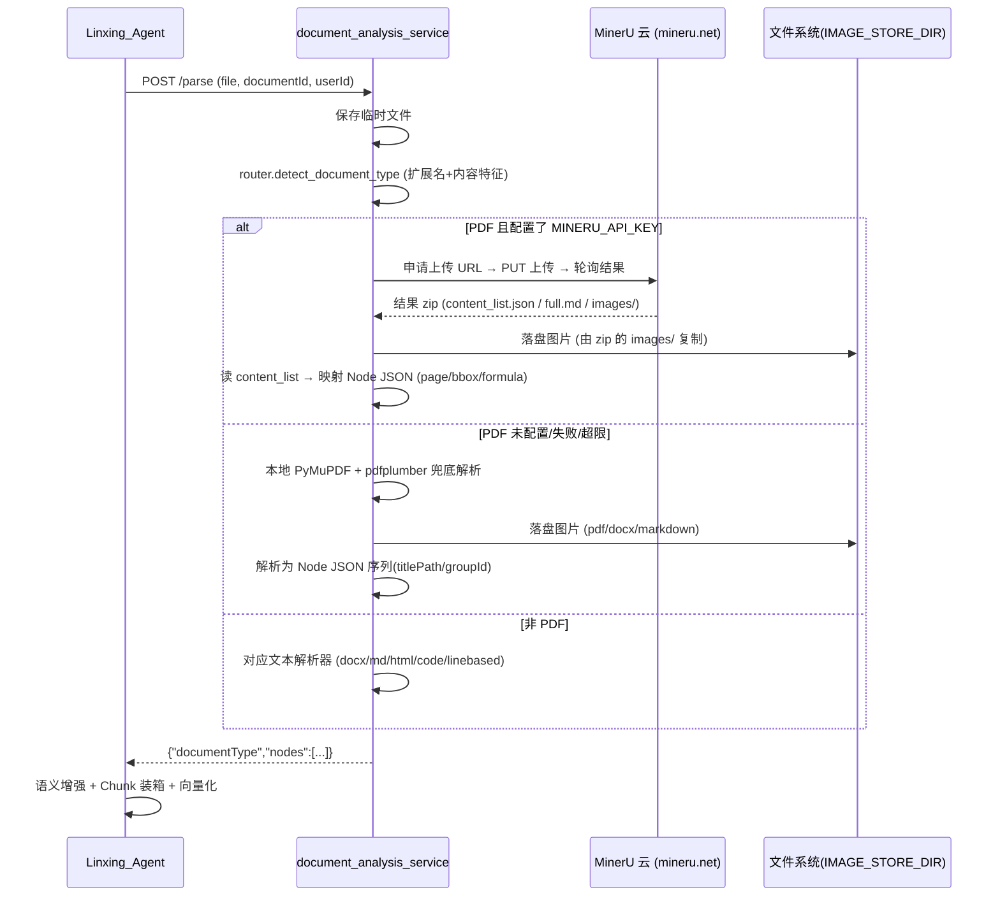
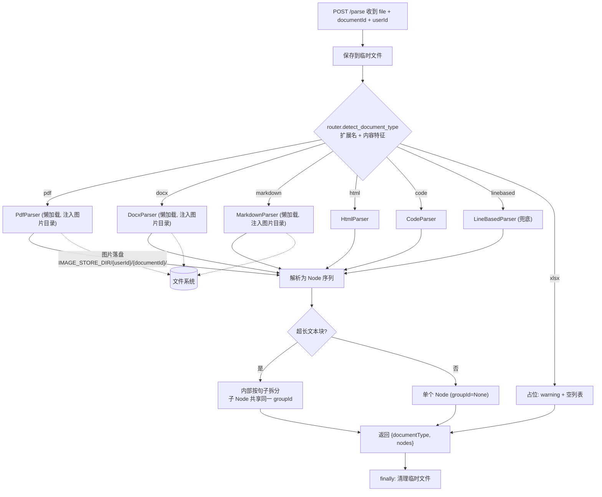

# document_analysis_service

Linxing 平台的 Python 文档解析服务。基于 FastAPI 提供统一的 `/parse` 端点，把任意上传文件解析为有序、原子化的 Node JSON 序列，供 Java 后端（`Linxing_Agent`）消费并完成后续语义增强、Chunk 装箱与向量化。

> 本 README 仅介绍当前服务。项目整体架构见根目录 [README.md](../README.md) 与 [AGENTS.md](../AGENTS.md)。

## 服务简介（Overview）

**职责**：文档结构化解析的唯一入口。接收 Java 侧上传的原始文件，按文件类型路由到对应解析器，输出统一协议的 Node JSON 列表；PDF / DOCX / Markdown 中的图片直接落盘到 Java 配置的存储目录，Java 侧无需搬运。

**PDF 解析引擎（2026-08-18 起）**：主路径为 **MinerU 云托管解析**（`parsers/mineru_client.py`，官方 v4 API + Bearer token），云端把 PDF 转成结构化 `content_list.json`（含 page/bbox/formula），本服务据此映射为 Node JSON；未配置 `MINERU_API_KEY`、文件超 MinerU 上限、或云端任一环节失败时，自动回退到本地 PyMuPDF + pdfplumber（`_parse_legacy`，原实现完整保留）。

**在系统中的位置**：

```
Linxing_Agent (8080)
   │  POST /parse  (multipart: file + documentId + userId)
   ▼
document_analysis_service (18000)
   │  按扩展名 + 内容特征路由 → parser
   │  pdf → MinerU 云 (mineru.net)  或  本地 PyMuPDF 兜底
   │  pdf/docx/markdown 图片落盘到 IMAGE_STORE_DIR/{userId}/{documentId}/
   ▼
   ◀──── {"documentType": "...", "nodes": [...]} ──── 返回 Java 侧
```

**为什么存在**：PDF/DOCX 等二进制文档与结构化文本（Markdown/HTML/代码）的解析能力在 Python 生态更成熟（PyMuPDF、pdfplumber、python-docx、mistune、beautifulsoup4），且 PDF 结构解析交由 MinerU 云端承担（扫描件 OCR、公式、复杂版式质量更高）。本服务把"文档 → Node"这一步从 Java 侧剥离出来，统一以 HTTP 契约交付，Java 侧不再承担解析职责（Java 侧解析备用方案截止0712未实现）。

## 核心功能（Features）

- **统一解析入口**：单端点 `/parse` 接收 multipart 文件 + `documentId` + `userId`，返回 `{"documentType", "nodes"}`
- **多类型解析器**：PDF / DOCX / Markdown / HTML / 源代码 / 行式文本六类解析器，签名一致、层级平等
- **MinerU 云端 PDF 解析**：配置 `MINERU_API_KEY` 后 PDF 主路径走 MinerU 云托管（`content_list.json` 保留 page/bbox/formula/表格 HTML/代码，扫描件 OCR 亦支持）；失败/未配置自动回退本地 PyMuPDF，入库不被云端抖动阻塞
- **统一 Node 协议**：所有解析器输出与 Java 侧 `NodeDTO` 对应的 Node dict（`id/type/text/imagePath/html/language/level/page/bbox/hash/titlePath/groupId`）
- **titlePath 标题路径**：跨块维护标题栈，每个 Node 都带 `titlePath`（如 "第一章 > 第一节"），保留文档层级
- **超长块内部拆分 + groupId**：超长文本/段落按句子拆为多个小 Node，共享同一 `groupId` 标识同源整块，由 Java 侧据 `groupId` 合成父子 Chunk
- **图片预估字数参与 flush**：图片本身无文本，但以 `IMAGE_ESTIMATED_CHARS=120`（VLM 增强后产出描述的中位数预估）计入前后文本累加的 flush 判断，避免"一遇到图片就无条件截断文本聚类"导致长文本+图被跨 chunk 切开
- **图片落盘**：PDF/DOCX/Markdown 中的图片提取并保存到 `IMAGE_STORE_DIR/{userId}/{documentId}/`，返回相对 URL（`/chunk_images/{userId}/{documentId}/img_n1.png`）
- **健康检查**：`GET /health`

## 技术栈（Tech Stack）

| 技术 | 用途 |
|---|---|
| FastAPI 0.115.6 + Uvicorn | Web 框架与 ASGI 运行时 |
| python-multipart | multipart/form-data 文件上传 |
| requests | MinerU 云托管 API 客户端（申请上传 URL / PUT 上传 / 轮询 / 下载 zip） |
| PyMuPDF (fitz) 1.24+ | PDF 本地兜底解析：文本/图片抽取、字号扫描（`_parse_legacy`） |
| pdfplumber | PDF 本地兜底解析：表格抽取（`_parse_legacy`） |
| python-docx | DOCX 段落/表格/图片遍历 |
| mistune 3 | Markdown 结构识别（AST） |
| beautifulsoup4 | HTML DOM 遍历 |
| Pillow | 图片尺寸读取 |
| Python 标准库 `re` | 代码/行式文本解析、所有解析器的领域逻辑 |

## 项目结构（Project Structure）

```
document_analysis_service/
├── app.py                 # FastAPI 入口：/parse、/health、临时文件管理
├── config.py              # 环境变量配置（HOST/PORT/IMAGE_STORE_DIR/IMAGE_URL_PREFIX/LOG_LEVEL/MINERU_*）
├── requirements.txt       # 依赖清单
├── __init__.py            # 包说明
└── parsers/
    ├── __init__.py        # 子包说明 + PdfParser/DocxParser 懒加载（PEP 562）
    ├── router.py          # 唯一派发入口：detect_document_type + parse
    ├── mineru_client.py   # MinerU 云托管 API 客户端（v4 鉴权/上传/轮询/下载解压）
    ├── _common.py         # 共享纯函数：node id 生成器、titlePath、哈希、弹性阈值、表格 HTML、语言检测、IMAGE_ESTIMATED_CHARS
    ├── pdf_parser.py      # PDF 解析（主：MinerU content_list；备：PyMuPDF + pdfplumber）
    ├── docx_parser.py     # DOCX 解析（python-docx）
    ├── markdown_parser.py # Markdown 解析（mistune 3 AST + 手写领域逻辑）
    ├── html_parser.py     # HTML 解析（beautifulsoup4 + 手写领域逻辑）
    ├── code_parser.py     # 源代码解析（标准库 re，类/函数边界拆分）
    └── linebased_parser.py# 行式文本解析（log/csv/tsv/txt，标准库 re）
```

## 系统职责（Responsibilities）

**本服务负责**：

- 文档类型识别（扩展名 + 内容特征二次判定）
- 文档结构化解析为统一 Node JSON 序列
- 跨块 titlePath 标题路径推导
- 超长文本块内部拆分 + `groupId` 同源标识
- PDF / DOCX / Markdown 图片提取与落盘（按 `userId/documentId` 隔离）
- 表格转 HTML、代码语言启发式检测

**本服务不负责**：

- 用户管理、鉴权、业务持久化（由 Java 侧承担）
- 向量存储与检索、Embedding（由 Java 侧承担）
- VLM 图片语义理解、LLM 代码/表格语义增强（由 Java 侧 `SemanticEnhancementService` 承担）
- Chunk 装箱与父子 Chunk 合成（由 Java 侧 `NodeBasedChunkBuilder` 承担）
- OCR（本地兜底路径无 OCR 能力；**MinerU 云端路径支持扫描件 OCR**——配置 `MINERU_API_KEY` 后扫描 PDF 亦能解析出文本）
- VLM / Embedding 模型加载（本服务不持有任何模型）

## 服务边界（Service Boundary）

| 维度 | 说明 |
|---|---|
| **输入** | HTTP `POST /parse`，multipart/form-data：`file` + `documentId` + `userId` |
| **输出** | JSON `{"documentType": str, "nodes": List[Node dict]}`；副作用：图片落盘到 `IMAGE_STORE_DIR/{userId}/{documentId}/` |
| **调用方** | `Linxing_Agent`（`DocumentAnalysisFacade` → `PythonDocumentAnalysisServiceImpl`，Spring `RestClient`） |
| **被调用方（PDF 主路径）** | MinerU 云托管 API（`https://mineru.net`，v4 Bearer token）：上传 PDF → 轮询 → 下载结果 zip（`content_list.json`/`full.md`/`images/`）。仅配置了 `MINERU_API_KEY` 时启用 |

## 与其它服务协作（Integration）

### 被 `Linxing_Agent` 调用

- 触发点：文档上传 `/rag/ingest/file` → `DocumentAnalysisFacade.analyze`
- Java 侧以 `multipart/form-data` POST 到 `/parse`，字段 `file` / `documentId` / `userId`，连接超时 10s，读取超时默认 600s（`rag.python-service.timeout-seconds`，2026-08-18 起默认 120→600，适配 MinerU 云端异步轮询耗时）
- 返回的 Node JSON 列表交给 Java 侧 `NodeConverter` → `SemanticEnhancementService` → `NodeBasedChunkBuilder` → 持久化

### 图片落盘契约

- 本服务把图片直接保存到 Java 配置的存储目录：`{IMAGE_STORE_DIR}/{userId}/{documentId}/img_{nodeId}.{ext}`
- 返回的 `imagePath` 是相对 URL：`/chunk_images/{userId}/{documentId}/img_{nodeId}.{ext}`
- Java 侧 `WebMvcConfig` 把 `/chunk_images/**` 暴露为静态资源（物理目录优先 `rag.python-service.image-store-dir`，回退 `rag.store-path/chunk_images`），并在 JWT 拦截器中放行该前缀
- 因此本服务的 `IMAGE_STORE_DIR` 必须与 Java 侧 `rag.store-path` 下的 `chunk_images` 指向同一物理目录，否则前端无法访问图片

### 数据流转



## 快速启动（Quick Start）

### 环境要求

- Python 3.10+
- `IMAGE_STORE_DIR` 指向的目录可写（与 Java 侧 `rag.store-path/chunk_images` 同物理目录）
- （可选，启用 MinerU 云解析）MinerU API key，见下

### 安装依赖

```bash
cd document_analysis_service
pip install -r requirements.txt
```

### 启动命令

```bash
# PDF 走 MinerU 云解析（推荐）：设置 API key 后 uvicorn
MINERU_API_KEY=你的key uvicorn app:app --host 0.0.0.0 --port 18000

# 未设置 MINERU_API_KEY 时，PDF 自动回退本地 PyMuPDF 解析
uvicorn app:app --host 0.0.0.0 --port 18000

# 方式二：直接运行 app.py（内部以 uvicorn 启动）
python app.py
```

### MinerU 云解析配置（环境变量）

| 变量 | 默认 | 说明 |
|---|---|---|
| `MINERU_API_KEY` | 空 | MinerU 云 API key（apiManage 页创建）。**空则不启用云端，PDF 走本地兜底** |
| `MINERU_BASE_URL` | `https://mineru.net` | API 基地址（实测 `api.mineru.net` 不可达，勿改） |
| `MINERU_MODEL_VERSION` | `vlm` | 模型版本：文档用 `vlm`；HTML 用 `MinerU-HTML` |
| `MINERU_POLL_INTERVAL` | `3` | 结果轮询间隔（秒） |
| `MINERU_TIMEOUT_SECONDS` | `480` | 云端处理总超时（上传+轮询+下载）；须小于 Java 侧 `rag.python-service.timeout-seconds`（600s），为"云端超时后回退本地"留余量 |
| `MINERU_MAX_FILE_MB` | `200` | MinerU 单文件上限（官方 200MB/200 页）；超限直接走本地兜底，不硬失败 |

## API

### `GET /health`

返回 `{"status": "ok"}`，供 Java 侧探活。

### `POST /parse`

`multipart/form-data`：

| 字段 | 类型 | 说明 |
|---|---|---|
| `file` | UploadFile | 待解析文档 |
| `documentId` | int | 文档 ID（图片目录隔离） |
| `userId` | int | 用户 ID（图片目录隔离） |

响应：

```json
{
  "documentType": "pdf",
  "nodes": [
    {"id": "n1", "type": "heading", "text": "...", "level": 1, "titlePath": "...", "page": 1, "bbox": [...]},
    {"id": "n2", "type": "image", "imagePath": "/chunk_images/.../img_n2.png", "hash": "...", "page": 1, "bbox": [...]},
    {"id": "n3", "type": "text", "text": "...", "groupId": null, "titlePath": "...", "page": 1, "bbox": null},
    {"id": "n4", "type": "table", "html": "<table>...</table>", "rowCount": 3, "colCount": 2, "titlePath": "...", "page": 1},
    {"id": "n5", "type": "code", "text": "...", "language": "java", "titlePath": "..."}
  ]
}
```

支持的扩展名（`app.py` 中 `supported` 集合）：

- 结构化：`pdf` `docx` `doc` `xlsx`（xlsx 暂未实现独立 parser，返回空列表 + warning）
- Markdown：`md` `markdown`
- HTML：`html` `htm`
- 代码：`java py js ts go rs c cpp cs kt rb php swift scala hs lua r sh bash sql`
- 行式文本：`log csv tsv txt`

### Node 协议字段

| 字段 | 适用 type | 说明 |
|---|---|---|
| `id` | 全部 | 自管递增 `"n1","n2"...` |
| `type` | 全部 | `heading` / `text` / `image` / `code` / `table` / `formula`（formula 由 MinerU 路径的 equation 块映射，Java 侧 FormulaNode 全链路支持） |
| `text` | heading/text/code/formula | 文本内容（formula 为 LaTeX 原文） |
| `imagePath` | image | 相对 URL |
| `html` | table | 表格 HTML 字符串 |
| `language` | code | 启发式检测的语言，可能为 `None` |
| `level` | heading | 1-6（MarkdownParser 限 1-3；MinerU 路径透传 text_level） |
| `page` | 全部 | PDF 真实页码（MinerU 路径为 `page_idx+1`），其余固定 `1` |
| `bbox` | 全部 | `[x, y, width, height]`；MinerU 路径为归一化 0-1000 坐标（`[x0,y0,x1,y1]`→`[x0,y0,w,h]`），其余 `None` |
| `hash` | image | 图片 MD5（去重用） |
| `titlePath` | 全部 | 标题路径，无标题上下文时 `None` |
| `groupId` | text | 超长块内部拆出的子 Node 共享同一 `groupId`；普通块 `None` |

## 开发说明（Development）

### 核心概念与代码位置

| 概念 | 位置 | 说明 |
|---|---|---|
| **入口程序** | [app.py](app.py) | FastAPI app，`/parse` 接收文件→保存临时文件→调用 `parsers.router.parse`→返回 JSON，`finally` 清理临时文件 |
| **Router（路由/派发）** | [parsers/router.py](parsers/router.py) | 唯一派发入口。`detect_document_type` 按扩展名+内容特征判定类型；`parse` 懒加载对应 parser 单例并注入图片目录配置 |
| **Parser（解析器）** | [parsers/](parsers/) | 六个解析器，签名统一：`parse(file_path, document_id, user_id) -> List[Node dict]`，层级平等 |
| **Chunk** | （本服务不产出 Chunk） | 本服务产出的是 Node，不是 Chunk。Chunk 装箱由 Java 侧 `NodeBasedChunkBuilder` 完成；`CHUNK_THRESHOLD` 常量在 parser 内仅用于"超长 Node 内部按句子拆分"的阈值 |

### 各解析器核心策略

| 解析器 | 文件 | 引擎 | 核心策略 |
|---|---|---|---|
| `PdfParser` | [pdf_parser.py](parsers/pdf_parser.py) | **MinerU 云（主）** + PyMuPDF/pdfplumber（兜底） | 云端路径：上传→轮询→下载 zip，读 `content_list.json` 映射 Node（title→heading/text_level、text→text、image→image、table→table(HTML)、code→code、equation→formula、list→text，含 page_idx→page、bbox、titlePath）；content_list 缺失兜底 full.md→MarkdownParser。本地兜底：全文档 span 字号中位数作标题基线；图片按 xref 匹配 bbox；页内按 bbox.y0 混合重排；跨页段落缝合；超长块按句子拆 + groupId |
| `DocxParser` | [docx_parser.py](parsers/docx_parser.py) | python-docx | 按 body 元素顺序遍历 w:p/w:tbl；标题识别 style.name 优先 + outline level 兜底；正文聚类缓冲（单空段=软换行，连续≥2 空段=硬分隔）；超长聚类按句子拆 + groupId |
| `MarkdownParser` | [markdown_parser.py](parsers/markdown_parser.py) | mistune 3 AST | mistune 识别结构边界，手写 titlePath 栈/超长拆分/groupId；无标题文档三级降级（强段落→弱段落→句子）；图片落盘 |
| `HtmlParser` | [html_parser.py](parsers/html_parser.py) | beautifulsoup4 | decompose 掉 script/style/head；按 HTML5 语义容器（section/article/...）划 Node 边界；table 转 HTML 原子块；文本块原子化不拆句子 |
| `CodeParser` | [code_parser.py](parsers/code_parser.py) | 标准库 re | 类/函数边界拆分；方法前注释通过 `_absorb_leading_comments` 归属到正确方法块；方法原子化不再内部拆分；语言优先扩展名映射 |
| `LineBasedParser` | [linebased_parser.py](parsers/linebased_parser.py) | 标准库 re | 三级降级拆分（强段落→弱段落→句子）+ 弹性阈值累加；列表项连续合并不被拆散 |

### 文档处理流程



### 懒加载策略

`fitz` / `pdfplumber` / `python-docx` / `mistune` / `beautifulsoup4` 均为重型依赖，仅在首次解析对应类型时才 `import`（见 [parsers/router.py](parsers/router.py) 的 `_get_*_parser` 与 [parsers/__init__.py](parsers/__init__.py) 的 PEP 562 `__getattr__`）。仅做类型判定或纯文本解析时不会强制加载这些库。`mineru_client.py` 仅依赖轻量的 `requests`，配置了 `MINERU_API_KEY` 时在 PDF 首次解析时随 `PdfParser` 一起构造。

### 新增解析器方式

1. 在 [parsers/](parsers/) 下新建 `xxx_parser.py`，实现 `parse(file_path, document_id, user_id) -> List[dict]`，返回 Node dict 协议与现有解析器一致
2. 在 [parsers/router.py](parsers/router.py) 的 `detect_document_type` 增加类型识别分支，在 `parse` 增加派发分支与 `_get_xxx_parser` 懒加载单例
3. 若有图片需求，构造时注入 `IMAGE_STORE_DIR` / `IMAGE_URL_PREFIX`；无图片需求直接单例
4. 在 [app.py](app.py) 的 `supported` 集合补充对应扩展名
5. 共享纯函数放 [parsers/_common.py](parsers/_common.py)，不要在 parser 间重复实现

### 测试方式

本服务当前无独立测试目录。开发调试可通过 `curl` 直接验证：

```bash
curl -X POST http://localhost:18000/parse \
  -F "file=@test.pdf" \
  -F "documentId=1" \
  -F "userId=1"
```

## 常见问题（FAQ）

**Q：Java 侧报"Java 文档解析备用方案尚未实现"或连接超时？**
A：本服务未启动或不可达。Java 侧 fallback 当前抛 `UnsupportedOperationException`，必须先启动本服务（默认 `localhost:18000`）。MinerU 云端异步轮询耗时大头在等待，大 PDF 解析调整 Java 侧 `rag.python-service.timeout-seconds`（2026-08-18 起默认 600s），且保证 Python 侧 `MINERU_TIMEOUT_SECONDS`（默认 480s）小于该值，给"云端超时后回退本地"留余量。

**Q：MinerU 云解析失败/未配置 key 时会怎样？**
A：自动回退本地 PyMuPDF + pdfplumber 路径，入库不被云端抖动阻塞。日志会打印 `MinerU 解析失败，回退本地 PyMuPDF` 的 warning（含异常栈）。如需完全启用云端，设置 `MINERU_API_KEY` 后重启本服务。

**Q：前端显示不出图片？**
A：检查 `IMAGE_STORE_DIR` 是否与 Java 侧 `rag.store-path/chunk_images` 指向同一物理目录，且 `IMAGE_URL_PREFIX`（默认 `/chunk_images`）与 Java 侧 `WebMvcConfig` 暴露的静态资源前缀一致。MinerU 路径的图片由本服务从结果 zip 的 `images/` 复制到该目录，契约不变。

## 进一步阅读

- [AGENTS.md](../AGENTS.md) — 整体架构、Python 服务与 Java 协作约束
- [根目录 README.md](../README.md) — 项目总览
- [Linxing_Agent/README.md](../Linxing_Agent/README.md) — Java 后端服务（消费方，含 `/parse` 调用与图片存储契约）
- [config.py](config.py) — 完整配置项
- [app.py](app.py) — 入口与 API
- [parsers/router.py](parsers/router.py) — 解析派发逻辑
